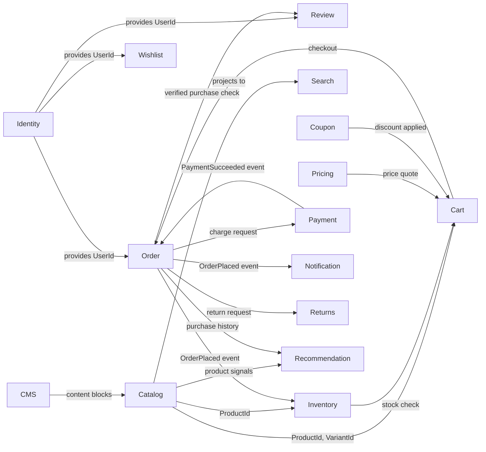
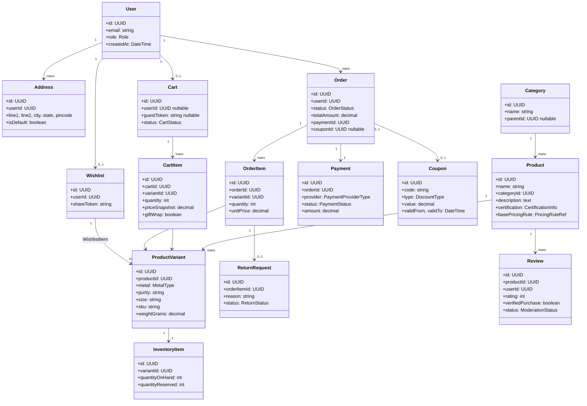
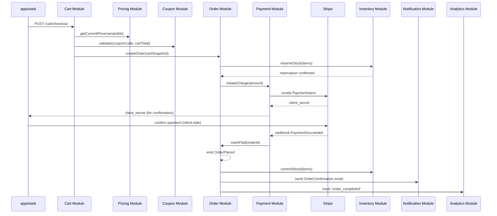
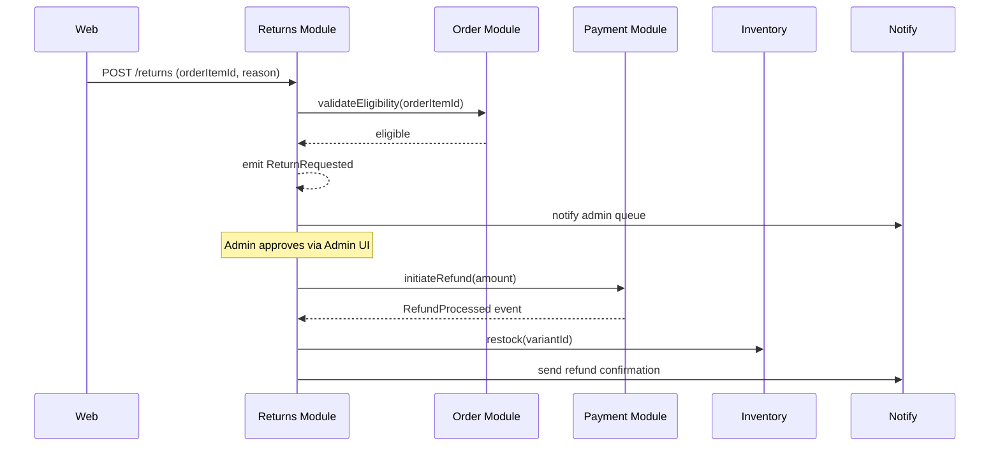
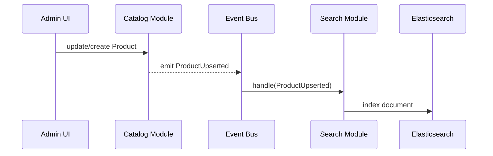

# Jwel — System Architecture

**Milestone 2 — System Architecture**
**Role:** Principal Solution Architect
**Input:** [`PRODUCT.md`](PRODUCT.md) (Milestone 1)
**Status:** Design only at Milestone 2. Since implemented and validated against
real local infrastructure in later milestones — see [`BACKEND.md`](BACKEND.md)
for what actually exists: Search/Elasticsearch (§8, Milestone 8) and a
rule-based Recommendation/AI module covering FR-14/FR-15 (§9, Milestone 9).
The bounded-context map and domain model below are the original design and
remain accurate; implementation specifics live in BACKEND.md, not here.

---

## 1. Architectural Style

Jwel is built as a **modular monolith on the backend, decoupled from a server-rendered
frontend**, structured internally with **Domain-Driven Design (DDD)** and **Clean
Architecture** layering. A modular monolith (not microservices) is chosen deliberately:

- The team/scale at MVP does not justify microservices' operational overhead
  (multiple deploys, distributed tracing, network-call latency between domains that
  are mostly read-heavy and tightly correlated, e.g. Catalog ↔ Inventory ↔ Pricing).
- **Module boundaries are still enforced in code** (see §3, Service Boundaries) so
  that any module can be extracted into its own deployable service later (e.g.
  Recommendation/AI module is the most likely first candidate to split out, since it
  has different scaling and deployment characteristics — model inference vs. CRUD).
- NestJS's module system maps directly onto DDD bounded contexts, making this
  extraction path low-cost when/if traffic demands it.

---

## 2. System Architecture Diagram

```mermaid
graph TB
    subgraph Client["Client Layer"]
        WEB["apps/web — Next.js 15 / React 19<br/>Storefront + Admin UI (SSR/ISR)"]
    end

    subgraph Edge["Edge / CDN"]
        CDN["CDN (static assets, images)"]
    end

    subgraph API["apps/api — NestJS Modular Monolith"]
        direction TB
        GW["API Gateway Layer<br/>(REST controllers, Swagger, validation, rate-limit)"]
        AUTHM["Auth Module"]
        CATM["Catalog Module<br/>(Product, Category, Variant)"]
        INVM["Inventory Module"]
        PRICEM["Pricing Module<br/>(gold-rate-linked pricing engine)"]
        CARTM["Cart Module"]
        ORDERM["Order Module"]
        PAYM["Payment Module<br/>(Stripe live / Razorpay stub, behind PaymentProvider port)"]
        COUPONM["Coupon/Discount Module"]
        REVIEWM["Review Module"]
        WISHM["Wishlist Module"]
        RETURNM["Returns Module"]
        RECM["Recommendation/AI Module"]
        SEARCHM["Search Module (ES adapter)"]
        USERM["User/Admin Module"]
        CMSM["CMS Module"]
        ANALYTICSM["Analytics Module (PostHog adapter)"]
        NOTIFM["Notification Module (Resend adapter)"]
        STORAGEM["Storage Module (S3 / swappable port)"]
        EVENTBUS["Internal Domain Event Bus"]
    end

    subgraph Data["Data & Infra"]
        PG[("PostgreSQL<br/>(Prisma ORM)")]
        REDIS[("Redis<br/>cache + session + queues")]
        ES[("Elasticsearch<br/>product search index")]
        S3[("AWS S3<br/>media storage")]
    end

    subgraph External["External Services"]
        STRIPE["Stripe"]
        RAZORPAY["Razorpay (stub, inactive)"]
        RESEND["Resend (email)"]
        POSTHOG["PostHog (analytics)"]
        AUTHJS["Auth.js providers"]
        GOLDRATE["Gold Rate Data Provider (TBD)"]
    end

    subgraph Observability["Observability"]
        PROM["Prometheus"]
        GRAFANA["Grafana"]
    end

    WEB -->|HTTPS/REST| GW
    WEB --> CDN
    CDN --> S3

    GW --> AUTHM & CATM & INVM & PRICEM & CARTM & ORDERM & PAYM & COUPONM & REVIEWM & WISHM & RETURNM & RECM & SEARCHM & USERM & CMSM & ANALYTICSM

    AUTHM --> AUTHJS
    AUTHM --> REDIS
    CATM --> PG
    INVM --> PG
    PRICEM --> PG
    PRICEM --> REDIS
    PRICEM --> GOLDRATE
    CARTM --> REDIS
    CARTM --> PG
    ORDERM --> PG
    PAYM --> STRIPE
    PAYM -.->|stubbed, not live| RAZORPAY
    COUPONM --> PG
    REVIEWM --> PG
    WISHM --> PG
    RETURNM --> PG
    RECM --> PG
    RECM --> REDIS
    SEARCHM --> ES
    USERM --> PG
    CMSM --> PG
    ANALYTICSM --> POSTHOG
    NOTIFM --> RESEND
    STORAGEM --> S3

    ORDERM -->|emits OrderPlaced, OrderShipped, etc.| EVENTBUS
    PAYM -->|emits PaymentSucceeded| EVENTBUS
    EVENTBUS --> NOTIFM
    EVENTBUS --> ANALYTICSM
    EVENTBUS --> INVM
    EVENTBUS --> RECM

    API -.metrics/logs.-> PROM --> GRAFANA
```



---

## 3. Service Boundaries (Bounded Contexts)

Each module below is a NestJS module = one DDD bounded context. Cross-module
communication happens **only** through (a) defined application-service interfaces,
or (b) domain events on the internal event bus — never by importing another
module's repository or entity directly. This is the rule that keeps future
microservice extraction cheap.

| Bounded Context | Owns | Does NOT own | Maps to PRD |
|---|---|---|---|
| **Identity** (Auth + User/Admin) | Accounts, sessions, roles, RBAC | Order history (references User ID only) | FR-1, FR-20 |
| **Catalog** | Products, Categories, Variants, media references | Stock counts, price | FR-2, FR-3, FR-4, FR-17 |
| **Inventory** | Stock levels per variant/SKU, reservations | Product content | FR-18 |
| **Pricing** | Gold-rate-linked price computation, making-charge rules | Discounts/coupons | NFR pricing concerns, FR-4 |
| **Cart** | Cart line items, gift-wrap/notes (pre-order) | Payment, stock decrement | FR-7 |
| **Coupon/Discount** | Coupon rules, validation, campaigns | Cart contents | FR-8, FR-22 |
| **Order** | Order lifecycle, status timeline | Payment processing, shipping carrier integration | FR-9, FR-10, FR-19 |
| **Payment** | Payment provider abstraction (Stripe live, Razorpay stub) | Order state (listens via events) | FR-9 |
| **Returns** | Return/exchange requests, refund status | Original order mutation | FR-11 |
| **Review** | Ratings, review content, moderation queue | Purchase verification logic (asks Order context) | FR-5 |
| **Wishlist** | Saved items, shareable links | Cart conversion logic | FR-6 |
| **Recommendation/AI** | Recommendation models, personalized collections, gift engine, try-on-prep data — **FR-14/FR-15 implemented Milestone 9 as rule-based co-occurrence + category affinity, not a trained model; gift engine (FR-13) and try-on-prep (FR-16) remain unimplemented** (BACKEND.md §9) | Catalog content itself (reads via Catalog API) | FR-12–16 |
| **Search** | Elasticsearch indexing/query, autosuggest — **implemented Milestone 8** (BACKEND.md §8) | Source-of-truth product data (Catalog owns it; Search is a read-optimized projection) | FR-3 |
| **CMS** | Banners, landing content, lookbook pages — **homepage banners implemented Milestone 10; landing content/lookbook still unimplemented** (BACKEND.md §10.1) | Product data | FR-23 |
| **Analytics** | Dashboard aggregation, PostHog event forwarding — **a live (uncached, no materialized views) dashboard summary implemented Milestone 10; PostHog forwarding still unimplemented** (BACKEND.md §10.2) | — | FR-21 |
| **Notification** | Email dispatch via Resend, templates | — | supports FR-9–11 |
| **Storage** | Swappable file storage port (S3 today) | — | NFR-9 |

### Context Map (relationships)



---

## 4. Domain Model

### 4.1 Core Aggregates

- **User** (aggregate root): Account, Profile, Address[], Role
- **Product** (aggregate root): ProductVariant[], CategoryRef, MediaRef[], CertificationInfo
- **Inventory Item**: tied 1:1 to ProductVariant, owns StockLevel + Reservation[]
- **Cart** (aggregate root): CartItem[] — each referencing ProductVariant snapshot
  (price/name at time of add, re-validated at checkout)
- **Order** (aggregate root): OrderItem[], OrderStatusHistory[], ShippingDetails,
  PaymentRef, CouponRef (nullable)
- **Return** (aggregate root): tied to OrderItem, ReturnStatusHistory[]
- **Review** (aggregate root): tied to Product + User, moderation state
- **Coupon** (aggregate root): Rule set, usage constraints, validity window
- **Wishlist** (aggregate root): WishlistItem[], shareToken

### 4.2 Domain Model Diagram



---

## 5. Event Flow

Internal domain events (in-process event bus at MVP; can be backed by Redis pub/sub
or a message broker later without changing publisher/subscriber contracts).

### 5.1 Checkout → Fulfillment Event Flow



### 5.2 Returns Flow



### 5.3 Catalog → Search Sync (eventual consistency)



### 5.4 Domain Events Catalog

| Event | Producer | Consumers |
|---|---|---|
| `UserRegistered` | Identity | Notification, Analytics |
| `ProductUpserted` / `ProductDeleted` | Catalog | Search, Recommendation |
| `StockReserved` / `StockReleased` / `StockCommitted` | Inventory | Order, Analytics |
| `CartCheckedOut` | Cart | Order |
| `OrderPlaced` | Order | Inventory, Notification, Analytics, Recommendation |
| `PaymentSucceeded` / `PaymentFailed` | Payment | Order, Notification |
| `OrderShipped` / `OrderDelivered` | Order | Notification, Analytics |
| `ReturnRequested` / `ReturnApproved` / `RefundProcessed` | Returns | Inventory, Payment, Notification |
| `ReviewSubmitted` / `ReviewApproved` | Review | Analytics, Recommendation |
| `CouponRedeemed` | Coupon | Analytics |

---

## 6. Security Architecture

Full detail in [`SECURITY.md`](SECURITY.md). Summary of architectural controls:

- **Auth boundary**: Auth.js issues signed sessions/JWT; all API Gateway routes pass
  through an `AuthGuard` + `RolesGuard` (NestJS guards) before reaching module
  controllers.
- **Payment data never touches Jwel's database** — PCI scope is delegated entirely
  to Stripe (live) / Razorpay (stub); only provider references/IDs are persisted.
- **Defense in depth at the Gateway layer**: rate-limiting, input validation
  (class-validator DTOs), CORS allowlist, Helmet headers, CSRF protection for
  cookie-based admin sessions.
- **Least privilege between modules**: a module's Prisma repository is private to
  that module; cross-module reads happen through explicit application service
  methods, preventing one compromised module from arbitrarily querying another's
  tables in code review terms (defense against accidental over-fetching, not a
  runtime sandbox).
- **Secrets**: all provider keys (Stripe, Resend, AWS, DB) injected via environment
  variables from AWS Secrets Manager/ECS task definitions — never committed.

---

## 7. Scalability Strategy

| Concern | Strategy |
|---|---|
| **Read-heavy catalog traffic** | Redis caches hot category/product list responses (TTL + event-driven invalidation on `ProductUpserted`); Next.js ISR for category/PDP pages reduces origin hits further |
| **Search load** | Elasticsearch is a dedicated read path, isolated from PostgreSQL — search traffic spikes don't degrade transactional DB |
| **Seasonal spikes (Diwali/wedding season)** | NestJS API runs on AWS ECS with auto-scaling policies keyed to CPU/request-count; stateless API containers (sessions in Redis, not in-memory) so horizontal scale-out is safe |
| **Checkout correctness under load** | Inventory reservation uses short-lived stock holds (Redis-backed lock or DB row-level lock + TTL) to prevent overselling during traffic spikes, released on cart abandonment/timeout |
| **Database scaling** | PostgreSQL read replicas for Analytics/reporting queries, keeping write-path (orders/inventory) on the primary; connection pooling (PgBouncer or RDS Proxy) at the infra layer |
| **Media delivery** | CDN in front of S3 for product imagery; image transformation/optimization at upload time, not request time |
| **Recommendation/AI module** | Designed as the first extraction candidate to its own service if inference load grows disproportionately to the rest of the monolith (see §1) |
| **Event bus growth path** | In-process event bus at MVP → swap to Redis pub/sub or SQS without changing module-level publisher/subscriber code, since events are dispatched through a single internal `EventBus` port |
| **Observability-driven scaling** | Prometheus + Grafana dashboards on request latency/error rate per module inform which bounded context to scale or extract first, rather than guessing |

---

## 8. Folder Structure (Design Only — Not Yet Created)

```
Jwel/
├── apps/
│   ├── web/
│   │   ├── app/                          # Next.js App Router
│   │   │   ├── (storefront)/
│   │   │   │   ├── page.tsx                  # Home
│   │   │   │   ├── shop/[[...filters]]/page.tsx
│   │   │   │   ├── category/[slug]/page.tsx
│   │   │   │   ├── product/[slug]/page.tsx
│   │   │   │   ├── bag/page.tsx
│   │   │   │   └── checkout/page.tsx
│   │   │   ├── (account)/
│   │   │   │   ├── wishlist/page.tsx
│   │   │   │   ├── orders/page.tsx
│   │   │   │   └── returns/page.tsx
│   │   │   ├── (admin)/
│   │   │   │   ├── products/...
│   │   │   │   ├── inventory/...
│   │   │   │   ├── orders/...
│   │   │   │   ├── users/...
│   │   │   │   ├── discounts/...
│   │   │   │   ├── analytics/...
│   │   │   │   └── cms/...
│   │   │   └── api/auth/[...nextauth]/route.ts  # Auth.js handler
│   │   ├── components/                   # app-specific composition (uses packages/ui)
│   │   ├── lib/                          # API client, auth helpers
│   │   └── styles/
│   └── api/
│       ├── src/
│       │   ├── modules/
│       │   │   ├── identity/                # Auth + User
│       │   │   │   ├── domain/                  # entities, value objects, domain services
│       │   │   │   ├── application/             # use-cases, DTOs, ports (interfaces)
│       │   │   │   ├── infrastructure/          # Prisma repo impl, Auth.js adapter
│       │   │   │   └── presentation/            # NestJS controllers
│       │   │   ├── catalog/
│       │   │   ├── inventory/
│       │   │   ├── pricing/
│       │   │   ├── cart/
│       │   │   ├── coupon/
│       │   │   ├── order/
│       │   │   ├── payment/
│       │   │   │   ├── domain/ports/payment-provider.port.ts
│       │   │   │   └── infrastructure/{stripe,razorpay}/
│       │   │   ├── returns/
│       │   │   ├── review/
│       │   │   ├── wishlist/
│       │   │   ├── recommendation/
│       │   │   ├── search/
│       │   │   ├── cms/
│       │   │   ├── analytics/
│       │   │   ├── notification/
│       │   │   └── storage/
│       │   │       ├── domain/ports/storage-provider.port.ts
│       │   │       └── infrastructure/{s3,filesystem}/
│       │   ├── shared/
│       │   │   ├── event-bus/                  # internal EventBus port + in-process impl
│       │   │   ├── guards/                      # AuthGuard, RolesGuard
│       │   │   └── filters/                     # exception filters
│       │   ├── prisma/
│       │   │   └── schema.prisma
│       │   └── main.ts
│       └── test/
├── packages/
│   ├── ui/
│   ├── types/                            # shared DTOs, domain event payload types
│   ├── config/
│   └── utils/
├── infra/
├── docs/
└── scripts/
```

---

## 9. API Contracts (Representative, Design-Level)

Full OpenAPI/Swagger generation happens at implementation time from NestJS
decorators; below is the contract shape agreed at design time for the core flows.

### `GET /api/v1/products`
```
Query: category?, metal?, purity?, gemstone?, priceMin?, priceMax?, sort?, page?, pageSize?
200 Response:
{
  "items": [
    {
      "id": "uuid",
      "name": "Twist Hoops",
      "slug": "twist-hoops",
      "category": "earrings",
      "priceFrom": 2599,
      "currency": "INR",
      "thumbnailUrl": "...",
      "certification": ["BIS_HALLMARK"],
      "ratingAverage": 4.2,
      "ratingCount": 128
    }
  ],
  "page": 1,
  "pageSize": 24,
  "total": 96
}
```

### `GET /api/v1/products/{slug}`
```
200 Response:
{
  "id": "uuid",
  "name": "Twist Hoops",
  "description": "...",
  "variants": [
    { "id": "uuid", "metal": "GOLD_PLATED", "purity": "18K", "size": null, "sku": "TH-GLD-01", "price": 2599, "stockStatus": "IN_STOCK" }
  ],
  "certification": { "type": "BIS_HALLMARK", "documentUrl": "..." },
  "reviews": { "average": 4.2, "count": 128 },
  "relatedProductIds": ["uuid", "uuid"]
}
```

### `POST /api/v1/cart/items`
```
Request: { "variantId": "uuid", "quantity": 1, "giftWrap": false }
201 Response: { "cartId": "uuid", "items": [...], "subtotal": 2599 }
```

### `POST /api/v1/cart/checkout`
```
Request: { "cartId": "uuid", "couponCode": "SHINE75"?, "shippingAddressId": "uuid", "paymentProvider": "stripe" }
200 Response: { "orderId": "uuid", "clientSecret": "...", "amountDue": 2599 }
```

### `GET /api/v1/orders/{id}`
```
200 Response:
{
  "id": "uuid",
  "status": "SHIPPED",
  "statusHistory": [{ "status": "PLACED", "at": "..." }, { "status": "SHIPPED", "at": "..." }],
  "items": [{ "variantId": "uuid", "name": "Twist Hoops", "quantity": 1, "unitPrice": 2599 }],
  "total": 2599
}
```

### `POST /api/v1/returns`
```
Request: { "orderItemId": "uuid", "reason": "SIZE_ISSUE", "notes": "..." }
201 Response: { "returnId": "uuid", "status": "REQUESTED" }
```

### `POST /api/v1/admin/products` (admin, role-guarded)
```
Request: { "name": "...", "categoryId": "uuid", "variants": [{ "metal": "...", "purity": "...", "weightGrams": 4.2 }], "images": ["storageRef1"] }
201 Response: { "id": "uuid" }
```

### `POST /api/v1/recommendations/gift-finder`
```
Request: { "recipient": "SPOUSE", "occasion": "ANNIVERSARY", "budgetMax": 15000, "styleHints": ["minimal", "gold"] }
200 Response: { "suggestions": [{ "productId": "uuid", "matchScore": 0.87 }] }
```

All endpoints versioned under `/api/v1/`; breaking changes require `/api/v2/`.
Auth required via `Authorization: Bearer <session-jwt>` except guest-cart/catalog
read endpoints. Admin endpoints additionally require `role: ADMIN|STAFF` claim,
enforced by `RolesGuard`.

---

## 10. Status & Open Items Carried Forward

- Gold-rate data source (flagged in PRODUCT.md §11) still **unresolved** — Pricing
  module is designed with a `GoldRateProvider` port so the integration can slot in
  without redesign once a provider is chosen.
- Returns reverse-logistics scope (store-credit-only vs. full reverse pickup) still
  **unresolved** — Returns module domain model already supports both (refund target
  is an abstraction, not hardcoded to original payment method).
- This milestone (2) was **design-only**; no Prisma schema, NestJS modules, or
  Next.js routes existed yet at the time it was written. That changed starting
  Milestone 5 — see BACKEND.md/FRONTEND.md for what's actually implemented.
- Search (FR-3) and a rule-based slice of Recommendation/AI (FR-14/FR-15) are
  now implemented (Milestones 8–9, BACKEND.md §8–9). Gift Recommendation
  Engine (FR-13), Personalized Collections beyond basic recommendations
  (FR-14, full scope), and Try-On Preparation (FR-16) remain unimplemented —
  consistent with PRODUCT.md's own MVP-scope call to ship only AI Product
  Recommendation (FR-15) in MVP and defer the rest.
- **Admin Portal implemented Milestone 10** (BACKEND.md/FRONTEND.md §10,
  §7): CMS (homepage banners only, FR-23's full scope still deferred per
  PRODUCT.md §11's original call) and Analytics (a live dashboard summary,
  not the materialized-view/PostHog design DATABASE.md §7.3 and this
  document's own Analytics row describe). The frontend admin routes landed
  at `/admin/products`, `/admin/orders`, etc. — a real, deliberate deviation
  from §8's folder sketch (`(admin)/products/...`, which would have
  collided with the storefront's own `/products` URLs).
