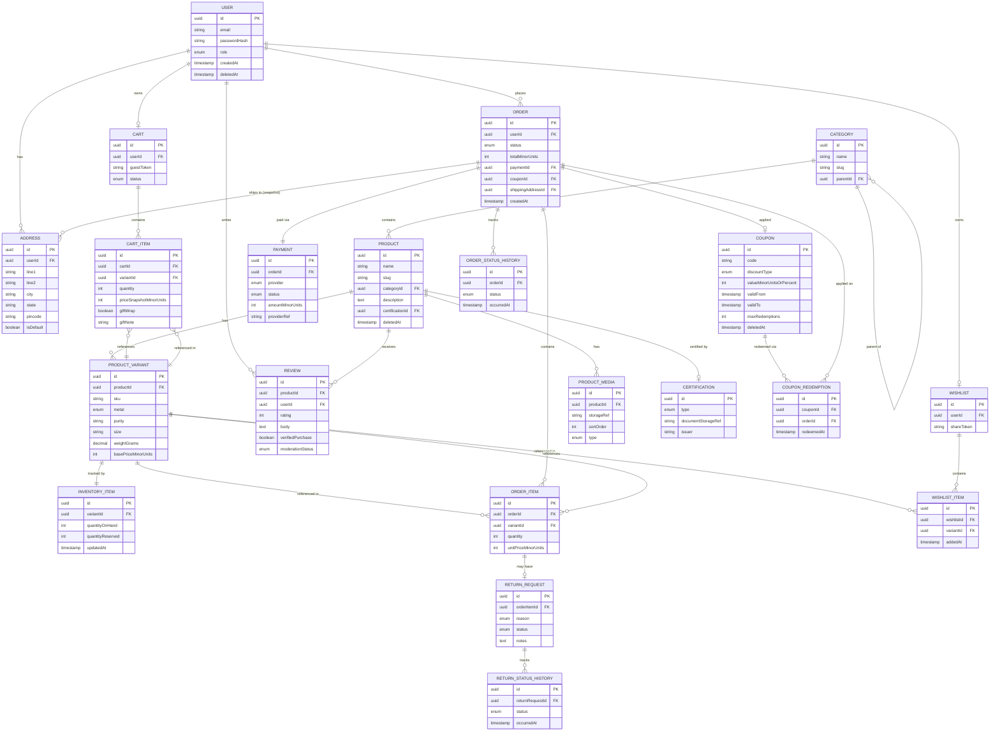

# Jwel — Database Design

**Originally Milestone 2 — System Architecture (design) · Implemented Milestone 4 — Database Engineering · Migrated and verified Milestone 7 · Recommendation tables added Milestone 9**
**Roles:** Principal Solution Architect (design) → Database Architect (implementation)
**Engine:** PostgreSQL (via Prisma ORM) · **Cache:** Redis · **Search index:** Elasticsearch (derived, not source of truth)
**Status:** Design, implemented Prisma schema, **and migrated against a real
local PostgreSQL 16 instance** (Milestone 7) — both the initial schema
migration and the §8.3 hand-authored follow-up (CHECK constraints + generated
`search_vector` column) applied cleanly. See §6 for what changed at
implementation time, [`BACKEND.md`](BACKEND.md) §6.1 for the migration/runtime
bugs that validation surfaced, [`BACKEND.md`](BACKEND.md) §9.6 for a Milestone
9 migration bug this same generated column caused again, and
[`apps/api/src/prisma/schema.prisma`](apps/api/src/prisma/schema.prisma) for
the concrete schema.

---

## 1. Design Principles

- PostgreSQL is the **single source of truth**. Elasticsearch holds a denormalized,
  eventually-consistent projection for search only (rebuildable from Postgres at any
  time — never authoritative).
- Redis holds **derived/ephemeral state**: sessions, hot-path price/category caches,
  stock-reservation locks, rate-limit counters. Nothing in Redis is the only copy of
  business-critical data.
- Monetary values stored as **integer minor units (paise)**, not floats, to avoid
  rounding errors — standard practice for financial data.
- All primary keys are **UUID v4** (avoids sequential-ID enumeration attacks on
  public product/order URLs, and simplifies future multi-region/sharding).
- Soft-delete (`deletedAt` nullable timestamp) on Product, Category, Coupon, User —
  preserves referential integrity for historical Orders even after a product is
  delisted.
- Every aggregate root carries `createdAt`/`updatedAt` for auditability.

---

## 2. Entity-Relationship Diagram



---

## 3. Table-by-Table Notes

### `users`
- `role`: enum `CUSTOMER | STAFF | ADMIN`.
- `passwordHash` nullable — Auth.js social logins won't have a local password.
- Index: unique on `email`.

### `addresses`
- Belongs to `users`; also referenced (denormalized snapshot, not FK-mutable) from
  `orders.shippingAddressId` so historical orders remain accurate even if a user
  edits/deletes a saved address later. Implementation detail: order-time address is
  copied into an immutable snapshot table or JSON column, not a live FK — flagged for
  Milestone 4 (Backend Domain) to finalize the exact mechanism.

### `categories`
- Self-referencing `parentId` for hierarchy (e.g. Earrings → Hoops).
- Index: unique on `slug`.

### `products` / `product_variants`
- `products` holds content (name, description, category, certification);
  `product_variants` holds purchasable SKUs (metal/purity/size combinations) —
  this split is what lets one Product page show multiple buyable options, matching
  the wireframe's PDP variant selector (Gold/Silver pills).
- `basePriceMinorUnits` on variant is the **pre-gold-rate-adjustment** base; final
  displayed price is computed by the Pricing module at read-time (see ARCHITECTURE.md
  §4 Pricing context) and cached in Redis, not persisted per-request.
- Index: unique on `sku`; index on `productId`.

### `product_media`
- `storageRef` is an opaque reference resolved by the Storage port (S3 key today,
  filesystem path if migrated) — never a raw public URL persisted, so migrating
  storage backends doesn't require a data migration of URLs.

### `certifications`
- One row per certification document (BIS Hallmark, IGI, GIA, etc.); a Product
  references one primary certification, multiple certificates per product deferred
  to Future Scope if needed (diamond + hallmark separately).

### `inventory_items`
- 1:1 with `product_variants`.
- `quantityReserved` is decremented back to 0 on cart-abandonment timeout or order
  cancellation — reservation TTL enforced via Redis lock, reconciled against this
  column (see ARCHITECTURE.md §7 Scalability).

### `carts` / `cart_items`
- Guest carts identified by `guestToken` (cookie-based) when `userId` is null;
  merged into the user's cart on login.
- `priceSnapshotMinorUnits` captured at add-to-cart time but **re-validated against
  live Pricing at checkout** — prevents stale gold-rate pricing from being honored
  indefinitely.

### `orders` / `order_items` / `order_status_history`
- `orders.status` enum: `PLACED | CONFIRMED | PROCESSING | SHIPPED | DELIVERED |
  CANCELLED | REFUNDED`.
- Status changes always append to `order_status_history` rather than only mutating
  `orders.status` — gives Order Tracking (FR-10) a full timeline for free.
- `order_items.unitPriceMinorUnits` is immutable once written — orders must reflect
  exactly what was charged, regardless of later price changes.

### `payments`
- `provider` enum: `STRIPE | RAZORPAY`. Razorpay rows will not be created in MVP
  (stub only) but the enum and table exist so activating it later is a config
  change, not a schema migration.
- No card/bank data ever stored — `providerRef` is the only link to the
  provider-side transaction.

### `return_requests` / `return_status_history`
- `reason` enum: `SIZE_ISSUE | DAMAGED | NOT_AS_DESCRIBED | CHANGED_MIND | OTHER`.
- `status` enum: `REQUESTED | APPROVED | REJECTED | REFUND_PROCESSING | REFUNDED`.
- Mirrors the Order status-history pattern for the same auditability reason.

### `reviews`
- `moderationStatus` enum: `PENDING | APPROVED | REJECTED` — supports the
  "unmoderated at launch + manual queue" path noted as an open question in
  PRODUCT.md, since the column exists regardless of which moderation policy ships.
- `verifiedPurchase` computed at write-time by checking for a `DELIVERED` order
  containing the same `productId` + `userId`.

### `coupons` / `coupon_redemptions`
- `discountType` enum: `PERCENTAGE | FLAT | FIRST_ORDER`.
- `coupon_redemptions` is an append-only ledger — enables enforcing
  `maxRedemptions` and per-user redemption limits via a count query rather than a
  mutable counter (avoids race conditions under concurrent checkouts).

### `wishlists` / `wishlist_items`
- `shareToken` is a unique, unguessable token enabling the "share wishlist via
  WhatsApp" journey (Journey A) without exposing the user's account.

### `product_views` / `product_co_occurrences` *(added Milestone 9 — Recommendation Engine, FR-14/FR-15)*
- `product_views` is an append-only event log, not a dedup'd "last viewed"
  table — Recently Viewed needs the full timestamp history to de-duplicate
  by recency in the application layer, not just the most recent row per
  product. Exactly one of `user_id` / `anonymous_id` is populated per row
  (enforced in `RecommendationsService`, not a DB constraint — Prisma has no
  portable way to express a partial-unique/XOR check here).
- `product_co_occurrences` is the one precomputed table in the recommendation
  engine (Trending and Personalized are computed on read instead). One row
  per unordered product pair — `product_a_id` is always the
  lexicographically smaller id of the two, enforced by the application layer
  at write time, so a lookup for either product in the pair must check both
  columns (`WHERE product_a_id = $1 OR product_b_id = $1`).
- See [`BACKEND.md`](BACKEND.md) §9 for the full design and validation
  results, including a real bug this milestone's migration hit against the
  `search_vector` generated column (§9.6) — the same class of issue
  DATABASE.md §8.3 already flags as a Prisma `Unsupported(...)` limitation.

### `banners` *(added Milestone 10 — Admin Portal, FR-23 minimal slice)*
- Backs the CMS module's only implemented surface (homepage banners) —
  PRODUCT.md §11 deferred FR-23's full scope (category landing content,
  lookbook/editorial pages) out of MVP, and this milestone doesn't revisit
  that call, just builds the minimal real piece the Admin Portal brief asked
  for.
- `starts_at`/`ends_at` are both nullable and independently optional — a
  banner can be "always active while `is_active`," "active from a future
  date," "active until a past date," or any combination; `CmsService
  .listActiveBanners` treats a null bound as unconstrained on that side.
- Hard-deleted (no `deleted_at`), unlike Product/Category/User/Coupon —
  nothing else references a banner by foreign key, so there's no historical
  integrity to preserve by soft-deleting it.
- Hit the same recurring Prisma migration-generator bug against
  `products.search_vector` as Milestones 8 and 9 (BACKEND.md §10.6) — by
  this point a recognized pattern with a known fix, not a fresh
  investigation.

---

## 4. Caching Layer (Redis) — Key Design

| Key pattern | Purpose | TTL |
|---|---|---|
| `session:{sessionId}` | Auth.js session payload | session lifetime |
| `price:variant:{variantId}` | Computed gold-rate-adjusted price | short TTL (minutes), invalidated on gold-rate update event |
| `catalog:category:{slug}:page:{n}` | Cached category listing response | minutes, invalidated on `ProductUpserted` |
| `stock-lock:variant:{variantId}` | Short-lived reservation lock during checkout | seconds–minutes, auto-expire |
| `cart:guest:{guestToken}` | Guest cart fast-path (mirrors Postgres row) | session lifetime |
| `ratelimit:{ip|userId}:{route}` | Rate-limiting counters | rolling window |

---

## 5. Search Index (Elasticsearch) — Document Shape

```json
{
  "productId": "uuid",
  "name": "Twist Hoops",
  "category": ["earrings", "hoops"],
  "metal": ["gold-plated"],
  "purity": ["18k"],
  "priceMinMinorUnits": 259900,
  "priceMaxMinorUnits": 259900,
  "ratingAverage": 4.2,
  "ratingCount": 128,
  "inStock": true,
  "tags": ["new-drop", "bestseller"]
}
```
Rebuilt via full reindex job from PostgreSQL on demand; kept incrementally in sync
via the `ProductUpserted`/`ProductDeleted`/`StockCommitted` domain events (see
ARCHITECTURE.md §5.3).

---

## 6. Milestone 4 Implementation — Schema Location & Resolved Decisions

The concrete Prisma schema implementing this design lives at
[`apps/api/src/prisma/schema.prisma`](apps/api/src/prisma/schema.prisma).

**Resolved (were open after Milestone 2/3):**
- **Order-time address snapshot**: resolved as an **immutable JSON column**
  (`orders.shipping_address`), not a live FK to `addresses` and not a separate
  copy-table. Simplest option that fully satisfies the requirement (historical
  orders stay accurate even if the user edits/deletes the saved address) without
  an extra table to maintain.
- **Collections entity**: added as a first-class model (`collections` +
  `collection_products` join table) — not present in the Milestone 2 ERD, because
  it is an explicit required entity in Milestone 4's scope. Modeled as
  many-to-many with `Product` (a piece can belong to both "Gold Collections" and
  a seasonal drop simultaneously), distinct from `Category` (structural taxonomy)
  to match PRODUCT.md's "Gold Collections"/"Diamond Collections" product types
  and FR-14 (Personalized Collections).
- **Cart/CartItem and ProductVariant**: not in the milestone's literal entity
  list, but included as load-bearing dependencies — Orders cannot exist without
  a Cart→checkout path (FR-7), and Inventory/Reviews/Wishlist all key off
  `ProductVariant`, not `Product`, because purchasable units are metal/size/purity
  combinations (PDP variant selector, DESIGN.md §5.3). Flagged explicitly rather
  than silently expanding scope.

**Still open, carried forward:**
- Gold-rate provider integration shape (push vs. poll) — depends on the
  still-unresolved gold-rate data source (PRODUCT.md §11). Schema is unaffected
  either way; only the Pricing module's cache-invalidation trigger changes.
- Multi-certification-per-product support deferred; `products.certification_type`
  is currently one enum + one doc ref per product. Extending to a many-to-many
  `product_certifications` table later is additive, not a breaking migration.

---

## 7. Indexing & Constraint Strategy (Read / Search / Reporting Optimization)

### 7.1 High Read Load

| Technique | Where |
|---|---|
| Denormalized aggregates | `products.avg_rating` / `products.rating_count` avoid a `COUNT`/`AVG` over `reviews` on every PLP/PDP request — recomputed on `Review` insert/moderation-approve (write-through, not read-time aggregation) |
| Composite indexes matching query shape | `(category_id, status)` and `(status, created_at DESC)` on `products` directly match the PLP "browse category, newest first" access pattern instead of relying on the planner to combine single-column indexes |
| Covering the dominant Order access pattern | `(user_id, status)` on `orders` matches "my orders, optionally filtered by status" (Profile → Orders tab, DESIGN.md §5.6) |
| Redis in front of Postgres | Hot category/product responses and computed prices are cached (DATABASE.md §4) so Postgres only serves cache misses, not every request |

### 7.2 Search

- **Elasticsearch remains the primary search path** (ARCHITECTURE.md §3) — the
  Postgres-side search support below is a **fallback/admin-search** path only,
  used for internal admin product lookup and as a degraded-mode path if ES is
  unavailable, never the customer-facing search SLA (NFR-1: <300ms).
- `pg_trgm` extension + `GIN` trigram index on `products.name` — supports
  typo-tolerant `ILIKE`/similarity search for admin catalog lookup.
- A generated `tsvector` column (`products.search_vector`) with a `GIN` index —
  added via raw SQL migration (Prisma's `Unsupported("tsvector")` type marks the
  column but cannot generate it; see migration strategy §8.3) for full-text
  fallback search across name + description.

### 7.3 Reporting

| Technique | Where |
|---|---|
| BRIN indexes on append-only, time-ordered tables | `orders.created_at`, `users.created_at` — BRIN is far smaller and cheaper to maintain than B-tree for large, naturally-ordered tables, ideal for date-range reporting scans |
| Append-only ledgers | `coupon_redemptions`, `order_status_history`, `return_status_history` are never UPDATEd — safe to scan/aggregate without worrying about in-place mutation skewing historical reports |
| Read replica targeting | Analytics Dashboard (FR-21) queries are routed to a PostgreSQL **read replica** (ARCHITECTURE.md §7) so heavy reporting aggregation never competes with the transactional write path (checkout, inventory updates) for I/O |
| Materialized views (recommended, not yet created) | `mv_daily_sales(date, category_id, total_minor_units, order_count)` and `mv_product_performance(product_id, units_sold_30d, revenue_30d)` — refreshed on a schedule (e.g. hourly via `REFRESH MATERIALIZED VIEW CONCURRENTLY`), giving the Admin Analytics Dashboard sub-100ms reads instead of aggregating raw `order_items` on every dashboard load. Managed via raw SQL migrations, not Prisma schema (Prisma does not model materialized views) |

### 7.4 Constraints Not Expressible in `schema.prisma` (require raw SQL migration)

Prisma's schema DSL cannot express `CHECK` constraints directly. The following
are added via a raw SQL migration immediately after the initial Prisma migrate:

```sql
ALTER TABLE reviews
  ADD CONSTRAINT rating_range CHECK (rating BETWEEN 1 AND 5);

ALTER TABLE inventory_items
  ADD CONSTRAINT reserved_not_exceeding_on_hand
  CHECK (quantity_reserved <= quantity_on_hand);

ALTER TABLE inventory_items
  ADD CONSTRAINT non_negative_stock
  CHECK (quantity_on_hand >= 0 AND quantity_reserved >= 0);

ALTER TABLE order_items
  ADD CONSTRAINT positive_quantity CHECK (quantity > 0);

ALTER TABLE coupons
  ADD CONSTRAINT valid_date_range CHECK (valid_to > valid_from);
```

---

## 8. Migration Strategy

### 8.1 Tooling & Workflow

- **Prisma Migrate** is the migration engine: `prisma migrate dev` locally
  generates timestamped, versioned SQL migration files under
  `apps/api/src/prisma/migrations/`; `prisma migrate deploy` applies them in CI/CD
  against staging and production — never `db push` outside local prototyping,
  since `db push` does not produce a reviewable migration history.
- Every migration file is committed to git and code-reviewed like application
  code — schema changes are not exempt from PR review.
- Raw-SQL-only changes (CHECK constraints, generated `tsvector` column, GIN/BRIN
  index types Prisma can't express natively, materialized views) are added via
  `prisma migrate dev --create-only` followed by hand-editing the generated SQL
  file before applying — keeps them in the same versioned migration history as
  Prisma-generated changes instead of living in a separate ad hoc script.

### 8.2 Environment Promotion

```
local (dev DB, prisma migrate dev)
   → CI (ephemeral DB, prisma migrate deploy + schema drift check)
   → staging (prisma migrate deploy, manual smoke test)
   → production (prisma migrate deploy, run during low-traffic window for
                  anything beyond additive changes)
```

`prisma migrate diff` is run in CI to detect drift between the committed schema
and any environment's actual state before deploy is allowed to proceed.

### 8.3 Initial Migration Sequence

1. Enable extensions: `pgcrypto` (for `gen_random_uuid()`), `pg_trgm`.
2. `prisma migrate dev --name init` — generates all tables/enums/FKs/indexes
   expressible in `schema.prisma`.
3. Hand-authored follow-up migration: add CHECK constraints (§7.4), the
   generated `search_vector` column + trigger, and the GIN index on it:
   ```sql
   ALTER TABLE products ADD COLUMN search_vector tsvector
     GENERATED ALWAYS AS (
       to_tsvector('english', coalesce(name, '') || ' ' || coalesce(description, ''))
     ) STORED;
   CREATE INDEX products_search_vector_idx ON products USING GIN (search_vector);
   ```
4. Hand-authored migration: materialized views for reporting (§7.3), plus a
   scheduled refresh job (pg_cron or an application-level scheduled task).

### 8.4 Zero-Downtime Change Rules

- **Additive-first**: new nullable columns / new tables ship in their own
  migration, deployed before any application code that depends on them.
- **No destructive migration in the same deploy as the code that stops using the
  old shape** — drop a column only after a subsequent deploy confirms nothing
  reads/writes it (minimum one full release cycle in between).
- **Backfills run as separate, idempotent, batched jobs** (not inline in a
  migration transaction) for any table large enough that a single
  `UPDATE ... WHERE` would hold long locks — relevant primarily for `orders`/
  `order_items` once the platform has production order volume.
- **Renames are modeled as add-new-column → dual-write → backfill →
  cut-over-reads → drop-old-column**, never a bare `ALTER TABLE ... RENAME`
  against a live table with in-flight application traffic on the old name.

### 8.5 Seeding Strategy

- `apps/api/src/prisma/seed.ts` (to be implemented at Milestone 5/6) seeds:
  categories (Rings/Earrings/Necklaces/Bracelets/Pendants), a handful of
  collections (Gold/Diamond), demo products+variants+inventory, and one ADMIN
  user — strictly for local/staging environments, gated behind `NODE_ENV !==
  'production'` to prevent accidental seeding of demo data into production.

### 8.6 Rollback Strategy

- Prisma Migrate does not auto-generate down-migrations; each migration that is
  not purely additive must have a hand-written rollback SQL script stored
  alongside it in the migration folder, reviewed at the same time as the forward
  migration — so a rollback is never improvised under incident pressure.

---

## 9. Open Items Carried Forward

- Gold-rate provider integration shape (push vs. poll) — still depends on the
  unresolved gold-rate data source (PRODUCT.md §11); does not block schema
  implementation.
- Multi-certification-per-product support — deferred, additive when needed.
- Materialized view definitions (§7.3) are recommended but not yet created as
  actual migration files — flagged for Milestone 5/6 once real reporting query
  patterns from the Admin Analytics Dashboard are known, to avoid designing views
  against guessed queries.
