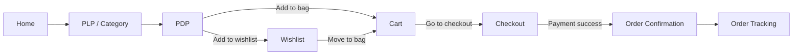
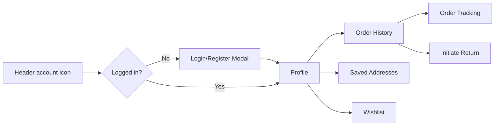
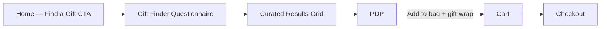
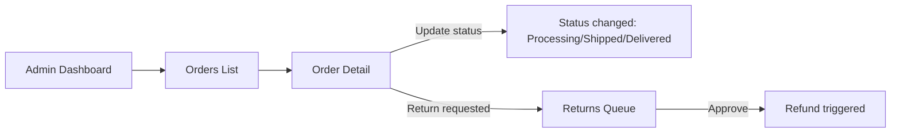

# Jwel — Design System & UX Specification

**Milestone 3 — UX/UI Design**
**Role:** Senior Product Designer
**Inputs:** [`PRODUCT.md`](PRODUCT.md), [`ARCHITECTURE.md`](ARCHITECTURE.md), [`docs/design/glint-wireframe.html`](docs/design/glint-wireframe.html)
**Style inspiration:** Cartier (ceremony, red/gold formality), Tiffany (whitespace,
restrained blue-as-accent, confident typography), BlueStone (trust signals,
Indian-market pricing/certification conventions), Apple (grid discipline, motion
restraint, content-first hierarchy)
**Status:** Design specification only — no code, no Figma file generated this
milestone. This document is the Figma-ready handoff spec (tokens + component specs
+ layout specs) a designer or design-to-code agent would build the file from.

---

## 1. Design Direction

Jwel's visual language evolves the existing GLINT wireframe's deep-violet/gold
palette into something closer to the four reference brands:

- **From Cartier**: a confident, ceremonial accent color reserved for CTAs and
  price emphasis only — never decorative. Generous padding around hero imagery.
- **From Tiffany**: the page is mostly quiet — neutral ivory/stone background,
  one accent color, large amounts of negative space around product photography so
  the jewellery (not the UI) is the visual subject.
- **From BlueStone**: certification badges, gold-rate context, and trust signals
  are first-class UI elements, not footnotes — they appear on PLP cards and PDP
  above the fold, matching Indian-market buyer expectations from PRODUCT.md.
- **From Apple**: strict 8px grid, large type scale jumps (not many in-between
  sizes), motion used only to clarify state change (Framer Motion), never for
  decoration.

**Principle:** every component must be config-driven (props/variants) so a client
revision is a token or prop change, not a rebuild — carried over from the
Milestone 0 architectural commitment.

---

## 2. Design Tokens (Figma Variables — ready to import as Figma Variable Collections)

### 2.1 Color Palette

| Token | Hex | Usage |
|---|---|---|
| `color/bg/canvas` | `#FAF6EF` | Page background (warm ivory, replaces GLINT's `#F0E8D8` with a slightly lighter, more Tiffany-quiet tone) |
| `color/bg/surface` | `#FFFFFF` | Cards, panels, modals |
| `color/bg/surface-alt` | `#F3ECDC` | Section bands (alternating content blocks, matches GLINT `#F4EDDD`/`#EDE5CE`) |
| `color/ink/primary` | `#1C0A2E` | Primary text (carried from GLINT — deep aubergine-black, luxury without pure black harshness) |
| `color/ink/secondary` | `#6B5030` | Secondary/supporting text |
| `color/ink/muted` | `#A09060` | Placeholder text, captions, disabled state |
| `color/brand/primary` | `#1F0A3D` | Primary CTA background, header bar (GLINT's existing deep violet — retained as Jwel's signature, distinguishing it from competitors' red/blue) |
| `color/brand/accent` | `#B8960C` | Ceremonial accent — ring/border on logo mark, price emphasis, certification badges (Cartier-inspired gold, used sparingly) |
| `color/accent/tiffany` | `#A6D6CE` (use sparingly) | Reserved accent for "new collection" / editorial moments only — a deliberate nod to Tiffany without copying their trademarked blue directly; optional, off by default |
| `color/feedback/success` | `#2E7D4F` | In-stock, order delivered, success toasts |
| `color/feedback/warning` | `#B8860C` | Low stock, pending return |
| `color/feedback/error` | `#B3261E` | Out of stock, form errors, payment failure |
| `color/border/default` | `#D9CEB0` | Card borders, dividers (from GLINT grid lines) |
| `color/border/strong` | `#1F0A3D` | Selected/focused state borders |
| `color/footer/bg` | `#140728` | Footer (from GLINT) |
| `color/footer/ink` | `#F2EAD4` | Footer text |

**Accessibility note:** `#1C0A2E` on `#FAF6EF` = contrast ratio ~14.8:1 (AA/AAA
pass). `#A09060` on white = ~2.9:1 — **restricted to non-essential captions only**,
never body copy or interactive labels, to stay within WCAG 2.1 AA (NFR-5).

### 2.2 Typography

Reference brands use serif-forward display type (Cartier, Tiffany) paired with a
clean sans body (Apple). Jwel's system:

| Token | Font | Weight | Size / Line-height | Usage |
|---|---|---|---|---|
| `type/display/xl` | Serif (e.g. "Fraunces" or "Playfair Display") | 600 | 56px / 1.04 | Hero headline (homepage, collection landing) |
| `type/display/l` | Serif | 700 | 44px / 1.05 | Page titles (PDP name, "My shopping bag") |
| `type/display/m` | Serif | 700 | 36px / 1.1 | Section headers ("Just in!", "Try our bestsellers") |
| `type/heading/l` | Sans (Helvetica/Inter) | 700 | 26px / 1.2 | Sub-section headers, filter panel title |
| `type/heading/m` | Sans | 600 | 19–22px / 1.2 | Card titles, product names in grid |
| `type/body/l` | Sans | 400 | 16px / 1.6 | Primary body copy, descriptions |
| `type/body/m` | Sans | 400 | 14px / 1.6 | Secondary copy, form labels |
| `type/body/s` | Sans | 400 | 13px / 1.5 | Captions, meta info (review count, SKU) |
| `type/label/mono` | Monospace (SF Mono/ui-monospace) | 500–600 | 11–13px, letter-spacing .14–.24em | Wireframe-style annotations, badges (NEW DROP), eyebrow labels |
| `type/cta` | Sans | 600 | 14px / 1 | Button labels |

**Rationale:** a serif display layer is the single biggest lever to read "luxury"
the way Cartier/Tiffany do, without changing GLINT's existing sans-based grid system
underneath — body/UI stays Helvetica/Inter (Apple-like clarity, good for dense
filter/admin UI), only display headlines shift to serif.

### 2.3 Spacing & Grid

- Base unit: **8px**. All padding/margin/gap values are multiples of 8
  (4px permitted only for icon-to-label micro-gaps).
- Desktop content max-width: **1280px**, with 32px outer gutter (matches GLINT's
  existing `padding:32px` convention).
- Grid: **12-column** for storefront pages, **4px-aligned 8pt grid** for admin
  dashboard density.
- Section vertical rhythm: 44–56px between major sections (matches GLINT's
  `padding:44px–56px` pattern, retained for consistency with the approved wireframe).

### 2.4 Elevation & Radius

| Token | Value | Usage |
|---|---|---|
| `radius/none` | 0px | Product imagery, luxury brands avoid rounded photography frames |
| `radius/s` | 5–6px | Buttons, inputs, filter chips |
| `radius/m` | 14px | Icon containers, badges |
| `radius/full` | 50% | Avatar, status dots, social icons |
| `elevation/card` | `0 1px 3px rgba(0,0,0,.10)` | Frame containers (from GLINT) |
| `elevation/modal` | `0 2px 20px rgba(0,0,0,.08)` | Overlay panels, hero callout cards |

### 2.5 Motion (Framer Motion tokens)

| Token | Duration | Easing | Usage |
|---|---|---|---|
| `motion/micro` | 120ms | ease-out | Button hover/press, checkbox toggle |
| `motion/transition` | 240ms | ease-in-out | Tab/filter switch, accordion expand |
| `motion/page` | 320ms | ease-out | Route transitions, modal open |
| `motion/none` | — | — | Respect `prefers-reduced-motion`; all of the above must have a no-motion fallback (instant state change) |

---

## 3. Component Library (Figma Component Specs)

Each entry below is one Figma component with variants — matches `packages/ui`
from ARCHITECTURE.md §8, so design and code share the exact same component
inventory and naming.

| Component | Variants | Props/Slots | Source pattern |
|---|---|---|---|
| `Button` | primary, secondary (outline), ghost, destructive · sizes: s/m/l · states: default/hover/pressed/disabled/loading | label, icon?, onPress | GLINT's "Shop now"/"Add to bag"/"Buy now" CTAs |
| `PromoBar` | default, dismissible | message, code? | GLINT sticky top bar |
| `Header` | storefront, admin | logo, nav items[], searchSlot, cartCount, accountMenu | GLINT header row |
| `SearchInput` | default, focused, with-results | placeholder, onQuery, suggestions[] | GLINT search box |
| `CategoryPill` | default, selected | label, icon? | GLINT quick-category strip |
| `ProductCard` | grid (PLP), feature (bestseller), compact (related/cart-suggestion) | image, name, priceFrom, badge?, rating?, ctaLabel? | GLINT product grid cell + bestseller card |
| `PriceTag` | default, strikethrough-compare, range | amount, currency, compareAt? | GLINT `₹2,599` chip |
| `CertificationBadge` | hallmark, igi, gia, sgl | type, documentLink? | New — BlueStone-inspired trust signal, not in original wireframe |
| `FilterAccordionItem` | collapsed, expanded | label, optionsSlot | GLINT sidebar filter rows |
| `CheckboxOption` | unchecked, checked, indeterminate | label, value | GLINT metal-type checkboxes |
| `RatingStars` | display (read-only), input (review form) | value, count? | GLINT `★★★★☆` |
| `VariantSelector` | pill-group | options[] (metal/size), selected | GLINT Gold/Silver pills on PDP |
| `QuantityStepper` | default, disabled-at-max | value, min, max | GLINT `− 1 +` |
| `Breadcrumb` | default | items[] | GLINT "Home › Earrings › Twist Hoops" |
| `Banner/Hero` | split (image+text), full-bleed-overlay | image, eyebrow, headline, body, ctas[] | GLINT Frame 01 vs 01b |
| `NewsletterSignup` | footer, modal | placeholder, onSubmit | GLINT footer email capture |
| `FooterColumnList` | help, other, social | title, links[] | GLINT footer columns |
| `CartLineItem` | default, editing | image, name, variant, price, qty, onRemove | GLINT bag row |
| `OrderSummaryRow` | item, subtotal, shipping, discount, total | label, value, emphasis? | Checkout/order pages |
| `StatusTimeline` | order-tracking, return-tracking | steps[], currentStep | New — needed for FR-10/FR-11, not in original wireframe |
| `Toast/InlineAlert` | success, warning, error, info | message, icon | New — system feedback, not in original wireframe |
| `Tabs` | underline style | items[], activeIndex | Used in Profile/Admin |
| `DataTable` | admin | columns[], rows[], pagination, rowActions[] | New — admin dashboard need |
| `StatCard` | admin | label, value, delta?, sparkline? | New — analytics dashboard need |
| `Modal/Drawer` | center-modal, right-drawer (cart preview) | title, body, footerActions[] | New — cart drawer, quick-view |
| `WishlistHeartToggle` | empty, filled, animating | productId, onToggle | New — wishlist interaction |
| `Pagination` | numbered, load-more | currentPage, totalPages | PLP grid |

---

## 4. User Flows

### 4.1 Primary Purchase Flow (maps to PRODUCT.md Journey A/D)



### 4.2 Account & Profile Flow



### 4.3 Gift Purchaser Flow (Journey B, future scope hook)



### 4.4 Admin Order Fulfillment Flow



---

## 5. Page Specifications (Figma-Ready Wireframe Specs)

For each page: layout structure, key components used (referencing §3), and content
priority. Pages reusing the approved GLINT wireframe note exactly what changes;
net-new pages (Profile, Wishlist, Order Tracking, Admin Dashboard) get full specs.

### 5.1 Home
- **Status:** Already wireframed (GLINT Frames 01/01b). Design-system update only:
  apply serif `type/display/xl` to hero headline, swap section background tokens
  to `color/bg/canvas`/`color/bg/surface-alt`, add `CertificationBadge` row beneath
  hero subhead (BlueStone-style trust signal not in original wireframe).
- **Structure:** PromoBar → Header → Hero (Banner/Hero) → CategoryPill row →
  ProductCard grid ("Just in!") → NewsletterSignup band → ProductCard grid
  ("Bestsellers") → Footer.

### 5.2 PLP (Product Listing Page)
- **Status:** Already wireframed (GLINT Frame 02/03). Design-system update: add
  `CertificationBadge` to each `ProductCard`, add `Pagination` at grid bottom
  (not present in original wireframe), convert filter chevrons to
  `FilterAccordionItem` component.
- **Structure:** PromoBar → Header → category Banner/Hero (category variant only) →
  Breadcrumb → Filter sidebar (FilterAccordionItem × N + CheckboxOption groups) →
  ProductCard grid (4-col desktop / 2-col mobile) → Pagination → Footer.

### 5.3 PDP (Product Detail Page)
- **Status:** Already wireframed (GLINT Frame 04). Design-system update: add
  `CertificationBadge` next to RatingStars, add `WishlistHeartToggle` on the
  product image, add `Toast/InlineAlert` for "Added to bag" confirmation.
- **Structure:** PromoBar → Header → Breadcrumb → [ProductImage gallery |
  ProductInfo: name, RatingStars, CertificationBadge, description, VariantSelector,
  QuantityStepper, PriceTag, Button(primary, "Add to bag")] → "Shop similar"
  ProductCard row (compact variant) → Footer.

### 5.4 Cart
- **Status:** Already wireframed (GLINT Frame 05). Design-system update: convert
  to `CartLineItem` component, add `OrderSummaryRow` block (subtotal/shipping/
  total) before checkout CTA — original wireframe lacked a price summary block.
- **Structure:** PromoBar → Header → Breadcrumb("‹ Back") → Page title →
  CartLineItem list → gift-wrap/newsletter CheckboxOption rows → OrderSummaryRow
  block (new) → Button(primary, "Go to checkout") + Button(secondary, "Back to
  store") → Footer.

### 5.5 Checkout
- **Status:** Already wireframed (GLINT Frame 06). Design-system update: add a
  `StatusTimeline` mini-stepper at top (Cart → Shipping → Payment → Confirmation)
  for orientation — Apple-style progress clarity, absent from original wireframe.
- **Structure:** PromoBar → Header → Breadcrumb("‹ Back") → StatusTimeline (new) →
  [Items overview: CartLineItem (read-only) + shipping method radio group +
  payment method radio group | Payment details: form fields + Button(primary,
  "Finish purchase")] → Footer.

### 5.6 Profile (NEW — not in original wireframe)
- **Purpose:** account hub — supports FR-1, FR-10, FR-11, persona "Priya"'s
  fast-repeat-purchase need for saved addresses/payment.
- **Structure:**
  - PromoBar → Header → Breadcrumb("Account")
  - Left rail: Tabs (vertical on desktop) — Overview / Orders / Addresses /
    Wishlist / Settings
  - Overview tab: account summary card (name, email, member-since), quick links
    to Order Tracking and Wishlist
  - Orders tab: `DataTable`-lite (simplified, non-admin styling) listing past
    orders with status chip, "Track" and "Return" actions per row
  - Addresses tab: card list of saved `Address` entries with default-address
    badge, add/edit/delete
  - Settings tab: email/password change form, newsletter preference toggle
- **Key components:** Tabs, DataTable (simplified variant), StatusTimeline (badge
  form), CertificationBadge (n/a here), Button, CheckboxOption.

### 5.7 Wishlist (NEW — not in original wireframe)
- **Purpose:** supports FR-6 and the wishlist-sharing acquisition loop from
  PRODUCT.md §10.
- **Structure:**
  - PromoBar → Header → Breadcrumb("Account › Wishlist")
  - Page title "Your wishlist" + `Button(secondary, "Share wishlist")` (generates
    shareToken link per DATABASE.md `wishlists.shareToken`)
  - ProductCard grid (grid variant, with `WishlistHeartToggle` filled + a
    "Move to bag" primary action replacing the default card CTA)
  - Empty state: illustration placeholder + "Browse the collection" CTA
- **Key components:** ProductCard (grid), WishlistHeartToggle, Button, Toast
  (on share-link-copied confirmation).

### 5.8 Order Tracking (NEW — not in original wireframe)
- **Purpose:** supports FR-10; standalone deep-linkable page (also embedded
  within Profile → Orders → Track).
- **Structure:**
  - PromoBar → Header → Breadcrumb("Account › Orders › #{orderId}")
  - Order summary card: order ID, date, OrderSummaryRow totals
  - `StatusTimeline` (order-tracking variant): Placed → Confirmed → Processing →
    Shipped → Delivered, with timestamps per completed step
  - CartLineItem list (read-only variant) for items in this order
  - Action row: `Button(secondary, "Initiate return")` (enabled only once
    Delivered), `Button(ghost, "Download invoice")`
- **Key components:** StatusTimeline, OrderSummaryRow, CartLineItem (read-only),
  Button.

### 5.9 Admin Dashboard (NEW — not in original wireframe)
- **Purpose:** supports FR-17–FR-23 (Product/Inventory/Order/User/Discount
  Management, Analytics, CMS).
- **Structure:**
  - Admin `Header` variant (denser, no promo bar/search-for-shopping — has
    "Search orders/products/users" admin search instead)
  - Left sidebar nav (fixed, icon+label): Dashboard, Products, Inventory, Orders,
    Returns, Users, Discounts, CMS, Analytics
  - Main content area, top section: `StatCard` row (Today's Sales, Orders Pending,
    Low Stock Alerts, Active Coupons) — 4-column grid, 8pt-grid dense spacing
    (Apple-like data density vs. storefront's generous luxury spacing — this is
    the one page where information density legitimately overrides whitespace)
  - Below: `DataTable` (full variant) — context-dependent: Recent Orders table on
    Dashboard home, full CRUD tables on each nav section (Products, Inventory,
    Users, Discounts)
  - Row actions: inline `Button(ghost)` icons (edit/view/delete) per DataTable row
  - CMS section: simplified visual block editor (banner image + headline + CTA
    fields) mapping directly to the Home page's `Banner/Hero` component — so
    admin content edits and storefront components share the same prop shape
- **Key components:** Header (admin variant), StatCard, DataTable, Tabs (for
  sub-views within a section), Modal/Drawer (for create/edit forms), Toast
  (save confirmations).

---

## 6. Responsive Behavior

- **Mobile-first breakpoints** (NFR-6): `sm` 0–639px, `md` 640–1023px, `lg`
  1024–1279px, `xl` 1280px+ (content max-width cap).
- PLP filter sidebar collapses to a bottom-sheet `Modal/Drawer` below `md`.
- `ProductCard` grid: 4-col (`xl`) → 2-col (`md`/`sm`) → never single-column except
  Wishlist empty state.
- Admin Dashboard sidebar collapses to a top tab bar below `lg` — admin is
  desktop-primary (internal tool) but must remain usable on tablet.
- Checkout `StatusTimeline` collapses from horizontal stepper to a vertical
  compact list below `md`.

---

## 7. Accessibility Specification (WCAG 2.1 AA, NFR-5)

- All interactive components (`Button`, `CheckboxOption`, `VariantSelector`,
  `WishlistHeartToggle`) require visible focus rings using `color/border/strong`,
  not color-alone state indication.
- `RatingStars` and `CertificationBadge` must carry `aria-label` text equivalents
  (e.g. "4.2 out of 5 stars, 128 reviews") — icons alone are insufficient.
- Minimum touch target 44×44px for all mobile-tappable controls (QuantityStepper
  buttons, WishlistHeartToggle, filter chips).
- Color contrast: `color/ink/muted` (#A09060) restricted to decorative/caption
  text only, per §2.1 note — never the sole carrier of required information.
- `StatusTimeline` and `DataTable` status chips must pair color with a text label
  (never color-only status indication, relevant for color-blind admin users too).

---

## 8. Figma File Organization (Handoff Spec)

Recommended Figma file structure for whoever builds the actual `.fig` file from
this spec:

```
Jwel (Figma file)
├── 🎨 Foundations (Variables: Color, Type, Spacing, Radius, Elevation per §2)
├── 🧩 Components (one frame per §3 component, all variants as Figma Variants)
├── 📄 Pages
│   ├── Home
│   ├── PLP
│   ├── PDP
│   ├── Cart
│   ├── Checkout
│   ├── Profile
│   ├── Wishlist
│   ├── Order Tracking
│   └── Admin Dashboard
├── 🔁 Flows (Figma flow-connectors matching §4 diagrams)
└── 📱 Responsive (mobile/tablet variants per §6, one frame set per page)
```

Each Component frame should be named `Component/Variant/State` (e.g.
`Button/Primary/Hover`) to match `packages/ui` prop/variant naming 1:1 — this is
what makes the eventual Figma → code handoff (or Figma MCP `get_design_context`
pass) produce components that map directly onto the existing monorepo structure
from ARCHITECTURE.md §8, instead of requiring re-interpretation.

---

## 9. Status & Open Items Carried Forward

- This milestone is **specification-only** — no `.fig` file, no HTML wireframes,
  and no code were produced. The GLINT wireframe (Home/PLP/PDP/Cart/Checkout)
  remains the only visual artifact that exists; Profile, Wishlist, Order Tracking,
  and Admin Dashboard exist only as the structural specs in §5.6–5.9 above.
- Recommend a follow-up design pass (could be Milestone 3b) to produce actual
  low-fi HTML/Figma wireframes for the four net-new pages, in the same visual
  style as `docs/design/glint-wireframe.html`, before Milestone 5 (Storefront Core)
  begins implementation against them.
- Serif display font choice (Fraunces vs. Playfair Display vs. another) is a
  recommendation, not finalized — needs a quick visual A/B before Foundations are
  locked in Figma.
