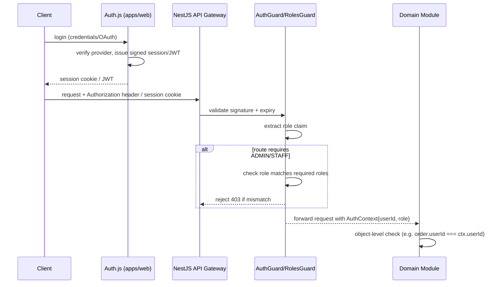

# Jwel — Security Architecture

**Milestone 2 — System Architecture**
**Role:** Principal Solution Architect
**Framework:** OWASP Top 10 (2021), aligned to NFR-4 in PRODUCT.md
**Status:** Design only — no implementation this milestone.

---

## 1. Threat Model Summary

Jwel handles three categories of sensitive data: **PII** (addresses, contact info),
**payment references** (never raw card data — delegated to Stripe/Razorpay), and
**high-value transactional data** (orders for luxury goods, attractive to fraud).
Primary threat actors: opportunistic credential-stuffing attackers, scrapers/bots
targeting catalog and pricing data, payment/coupon-abuse fraudsters, and
account-takeover attempts on customer accounts holding saved addresses.

---

## 2. OWASP Top 10 (2021) — Control Mapping

| # | Risk | Jwel Control |
|---|---|---|
| **A01** Broken Access Control | `AuthGuard` + `RolesGuard` on every NestJS route; admin routes require `role: ADMIN|STAFF` claim; object-level authorization checks (e.g. a user can only view their own Order/Return) enforced in application-service layer, not just route-level; no direct object reference exposure (UUIDs, not sequential IDs) |
| **A02** Cryptographic Failures | TLS everywhere (enforced at ALB/CDN); PII encrypted at rest (Postgres column-level encryption or RDS storage encryption); no card data stored (PCI scope delegated to Stripe/Razorpay); password hashing via Auth.js-managed adapter (bcrypt/argon2, never custom crypto) |
| **A03** Injection | Prisma parameterized queries exclusively — no raw SQL string concatenation; class-validator DTO validation at every controller boundary; Elasticsearch queries built via query-DSL builders, not string interpolation |
| **A04** Insecure Design | Threat modeling done per-module at design time (this document); rate-limiting and stock-reservation locking designed in from the start (ARCHITECTURE.md §7) rather than retrofitted; coupon abuse prevented by append-only `coupon_redemptions` ledger with per-user/global limits enforced server-side |
| **A05** Security Misconfiguration | Helmet middleware (security headers) on all API responses; CORS allowlist restricted to known frontend origins; environment-specific configs via AWS Secrets Manager, never hardcoded; default-deny on admin routes (explicit role grant required) |
| **A06** Vulnerable & Outdated Components | Dependabot/Renovate on the monorepo (GitHub Actions integration, configured at CI milestone); pinned dependency versions; `pnpm audit` gate in CI pipeline |
| **A07** Identification & Authentication Failures | Auth.js handles session/token lifecycle (no custom auth code to get wrong); rate-limited login/password-reset endpoints; account lockout/backoff on repeated failed logins; MFA hook point reserved in Auth.js config for future enablement |
| **A08** Software & Data Integrity Failures | CI pipeline validates lockfile integrity; signed/verified Docker base images; webhook signature verification mandatory for Stripe/Razorpay callbacks (reject unsigned/invalid-signature webhook payloads) |
| **A09** Security Logging & Monitoring Failures | All auth events, payment state transitions, and admin mutations logged with correlation IDs; Prometheus alerts on auth failure-rate spikes and checkout error-rate spikes; Grafana dashboards reviewed as part of Milestone 9 (Observability) |
| **A10** Server-Side Request Forgery (SSRF) | No user-supplied URLs are fetched server-side without an allowlist (e.g. gold-rate provider, Stripe, Resend endpoints are the only outbound destinations, all hardcoded by config, never user-influenced) |

---

## 3. AuthN/AuthZ Architecture

- **Roles**: `CUSTOMER`, `STAFF`, `ADMIN` (matches `users.role` in DATABASE.md).
  `STAFF` is scoped to operational admin functions (orders, returns, inventory);
  `ADMIN` additionally has user management and discount/CMS control. Fine-grained
  permission matrix to be finalized at Milestone 6 (Admin Panel) if STAFF needs
  sub-roles.
- **Session strategy**: Auth.js with database-backed sessions (not pure stateless
  JWT) so sessions can be revoked server-side (e.g. on password change, suspicious
  activity) — required for the account-takeover mitigation in §2 (A07).
- **Guest checkout**: identified via `guestToken` (signed, httpOnly cookie), scoped
  strictly to cart + order-confirmation read access for that token's order only —
  no broader account capabilities.

---

## 4. Payment Security

- **PCI DSS scope minimization**: Jwel never receives, transmits, or stores raw
  cardholder data. Stripe Elements / Stripe-hosted payment flows handle card entry
  client-side; Jwel's backend only ever sees a `PaymentIntent`/`clientSecret` and a
  `providerRef`. This keeps Jwel in **PCI DSS SAQ A** scope, not full PCI compliance.
- **Razorpay stub**: wired behind the same `PaymentProvider` port but not connected
  to live credentials; no Razorpay secret keys exist in any environment until
  explicitly activated in a future milestone.
- **Webhook integrity**: All payment-provider webhooks (Stripe `payment_intent.
  succeeded`, etc.) must pass signature verification before being processed; replay
  protection via idempotency keys on order state transitions (`OrderPlaced` etc. are
  idempotent on `providerRef`).
- **Amount integrity**: order total is recomputed server-side from `order_items` at
  charge time — the client-submitted amount is never trusted directly.

---

## 5. Data Protection & Privacy

- **PII inventory**: `users` (email), `addresses` (postal address), `orders`
  (shipping snapshot), `reviews` (optional photo uploads). Treated as sensitive;
  access restricted to the owning user + ADMIN/STAFF with audit logging.
- **Encryption at rest**: RDS-level encryption for PostgreSQL; S3 server-side
  encryption for uploaded media (review photos, certification documents).
- **Encryption in transit**: TLS 1.2+ enforced at the load balancer/CDN; internal
  service-to-service calls (API ↔ Postgres/Redis/ES) within the VPC, not exposed
  publicly.
- **Data retention**: soft-deleted users/products retained for order-history
  integrity but excluded from active queries (`deletedAt IS NULL` filters) and
  excluded from marketing/analytics exports.
- **Right to erasure readiness**: because PII is concentrated in `users` and
  `addresses` tables (not scattered across every module), a future GDPR/DPDP-style
  erasure request is a bounded operation — flagged as a design property, not yet a
  built feature.

---

## 6. Application-Layer Hardening

- **Input validation**: every DTO validated via `class-validator`/`class-
  transformer` at the NestJS controller boundary before reaching application
  services — rejects malformed/oversized payloads before they touch domain logic.
- **Rate limiting**: applied at the API Gateway layer per-route, with stricter
  limits on auth (`/login`, `/register`, `/password-reset`) and search endpoints
  to blunt credential-stuffing and scraping.
- **CSRF protection**: required for cookie-based admin sessions (Admin UI);
  token-based API auth for the storefront SPA/SSR calls is less CSRF-exposed but
  still validated for state-changing (POST/PUT/DELETE) requests.
- **Content Security Policy**: restrictive CSP headers on `apps/web` to mitigate
  XSS impact even if a sanitization gap is missed (defense in depth, not a
  substitute for output encoding).
- **File upload safety**: product media / review photo uploads validated for MIME
  type and size server-side before being handed to the Storage port; never
  trust client-declared content-type alone.

---

## 7. Infrastructure & Network Security

- **VPC isolation**: API/DB/Redis/ES run in private subnets; only the load
  balancer/CDN is internet-facing.
- **Secrets management**: AWS Secrets Manager + ECS task definition secrets
  injection; no secrets in source control, `.env` files are gitignored
  (already enforced — see root `.gitignore` from Milestone 0).
- **Least-privilege IAM**: ECS task roles scoped narrowly (e.g. API task role can
  write to its specific S3 bucket prefix, not the whole account).
- **CI/CD supply chain**: GitHub Actions workflows pinned to specific action
  versions (commit SHA, not floating tags) when implemented, to prevent
  supply-chain tampering — flagged for the DevOps/CI milestone.

---

## 8. Open Items Carried Forward

- Fine-grained STAFF sub-role permission matrix — deferred to Milestone 6 (Admin
  Panel), once the full set of admin actions is enumerated in detail.
- MFA activation policy (optional vs. mandatory for ADMIN role) — Auth.js hook
  point reserved, decision deferred.
- Data residency requirements (India-only data residency may be a compliance
  consideration for a PII-handling Indian e-commerce platform) — not yet confirmed
  with legal/compliance; flagged for follow-up before AWS region finalization.
